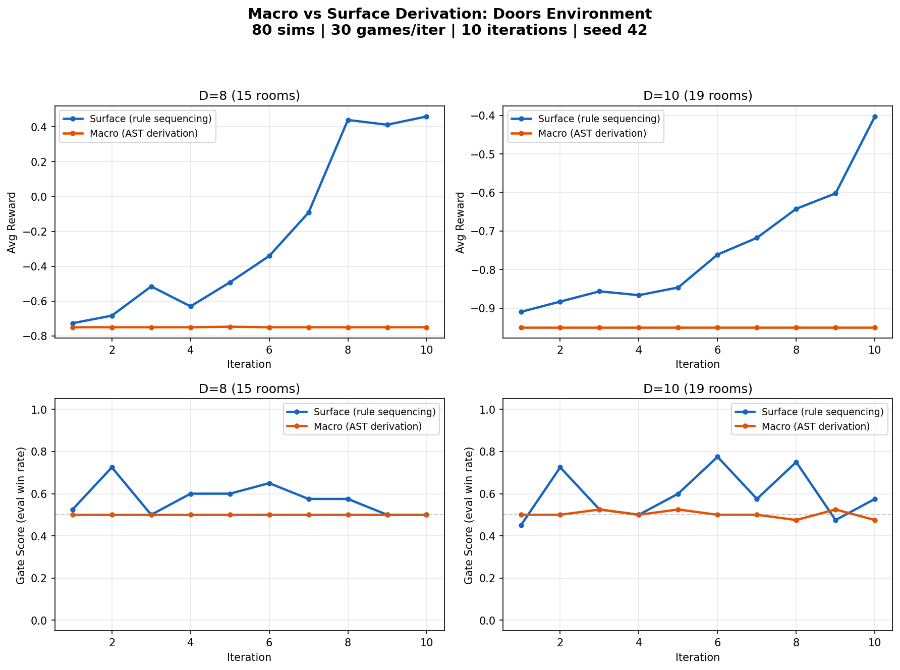
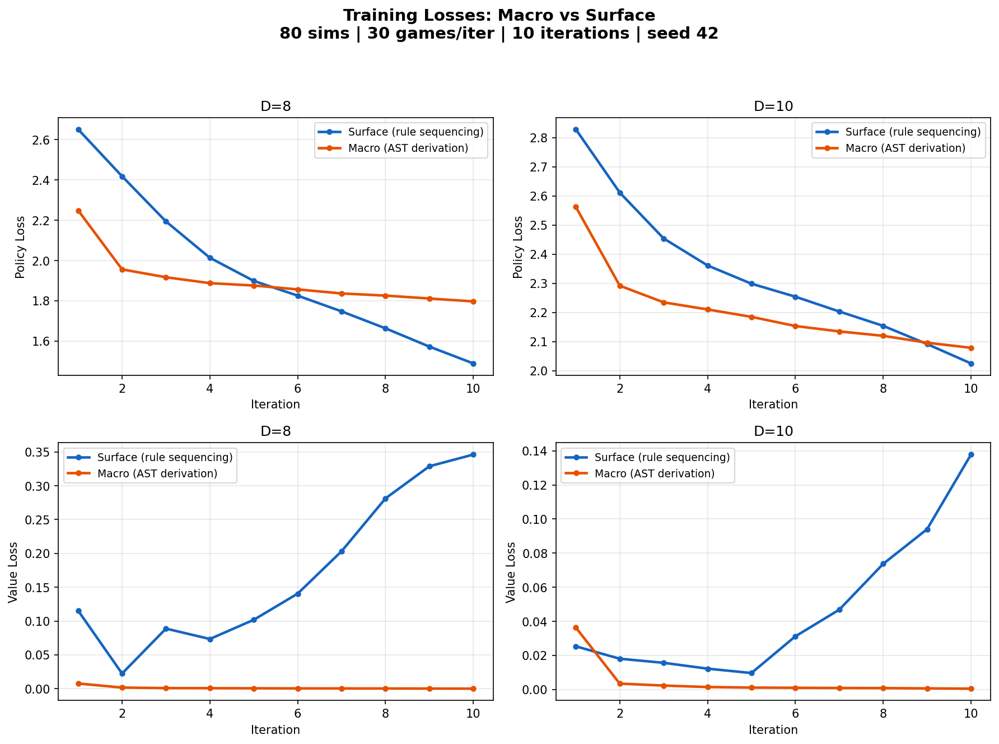

# D=8, D=10 Comparison: Surface vs Grammar (Macro) Derivation

**Date:** 2026-03-26
**Experiment:** `experiments/macro_vs_surface_comparison/20260326_155015/`

## Summary

We compare two program synthesis approaches on the Doors environment at D=8 and D=10:

- **Surface derivation** sequences high-level rules (PickRule, MoveRule, GoalRule) in a fixed-length episode of 2K+1 steps.
- **Grammar (macro) derivation** builds full ASTs via a context-free grammar with factored structure/parameter actions and PickRule/MoveRule macro productions.

Surface derivation learns effectively at both D=8 and D=10. Grammar derivation fails to learn at either scale within 10 iterations, demonstrating the scalability advantage of the surface formulation.

## Experimental Setup

All four experiments use **identical MCTS and training hyperparameters** (verified from config.json):

| Parameter | Value |
|-----------|-------|
| MCTS simulations | 80 |
| Games per iteration | 30 |
| Training iterations | 10 |
| Seed | 42 |
| Rollout completions | 4 (mode=max, blend=0.3) |
| Backup rule | max (topk=3, tau=0.1) |
| Network | Transformer d=64, 4 heads, 2 layers |
| Learning rate | 3e-4 |
| Policy weight | 2.0 |
| Accept threshold | 0.4 |

### Key Structural Difference

The approaches differ fundamentally in action space complexity:

| | Surface | Grammar (Macro) |
|---|---|---|
| **D=8** | 15 actions, 15-step episodes | budget=108, n_sites=31, variable-length |
| **D=10** | 19 actions, 19-step episodes | budget=138, n_sites=39, variable-length |
| **Search depth** | Fixed, shallow | Deep (up to budget) |
| **Dead ends** | None | Possible |

The grammar approach must search a vastly larger derivation tree (budget 108--138 AST nodes) compared to the surface approach's compact 15--19 step sequence. With only 80 MCTS simulations, the grammar approach cannot adequately explore this space.

## Results

### Final Metrics (Iteration 10)

| Experiment | Solve Rate | Final Reward | Gate Score | Policy Loss | Value Loss |
|------------|-----------|--------------|------------|-------------|------------|
| **Surface D=8** | **100%** | **+0.46** | 0.50 | 1.49 | 0.35 |
| Grammar D=8 | 0% | -0.75 | 0.50 | 1.80 | 0.00 |
| **Surface D=10** | **100%** | **+0.64** | 0.58 | 2.02 | 0.14 |
| Grammar D=10 | 0% | -0.95 | 0.48 | 2.08 | 0.00 |

### Learning Curves



**Top row (Avg Reward):** Surface reward climbs steadily across iterations at both D=8 and D=10. Grammar reward is flat at the minimum (-0.75 for D=8, -0.95 for D=10) -- no useful programs are discovered.

**Bottom row (Gate Score):** Surface gate scores fluctuate above 0.5 (new network sometimes wins), indicating genuine learning. Grammar stays locked at 0.5 (coin flip -- new and old networks are equally bad).

### Training Losses



**Policy loss:** Both approaches reduce policy loss over iterations, but this reflects memorization of the training data distribution, not discovery of good programs.

**Value loss:** This is the most diagnostic signal:
- Surface value loss **increases** (0.00 -> 0.35 for D=8) -- the network is learning to discriminate between good and bad partial sequences because the training data contains a mix of rewards.
- Grammar value loss stays at **~0.000** -- all programs score the same minimum reward, so there is no value signal to learn from.

## Interpretation

1. **Surface derivation scales to D=8 and D=10** with modest compute (80 sims, 10 iterations). The compact action space (2K+1 actions) allows MCTS to find solving programs within the first few iterations.

2. **Grammar derivation fails at D>=8** because the derivation tree is too deep for 80 MCTS simulations to navigate. The budget grows as O(D) (budget=108 at D=8, 138 at D=10), while the surface action space grows as O(K) with fixed episode length.

3. **The value loss diagnostic** cleanly separates learning from non-learning: a flat-zero value loss means the agent never encounters reward diversity -- it is stuck in a degenerate region of program space.

## Timing

| Experiment | Time per iteration | Total time |
|------------|-------------------|------------|
| Surface D=8 | ~16--30s | ~4 min |
| Surface D=10 | ~26--60s | ~6 min |
| Grammar D=8 | ~314--561s | ~63 min |
| Grammar D=10 | ~175--274s | ~37 min |

The grammar approach is 10--20x slower per iteration due to deep AST derivations, compounding the learning failure with a compute cost penalty.

## Files

| File | Description |
|------|-------------|
| `macro_vs_surface_D8_D10.png` | Main 2x2 comparison (reward + gate score) |
| `macro_vs_surface_losses.png` | Training losses (policy + value) |
| `surface_D8_metrics_*.png` | Surface D=8 individual training metrics |
| `surface_D10_metrics_*.png` | Surface D=10 individual training metrics |
| `macro_D8_metrics_*.png` | Grammar D=8 individual training metrics |
| `macro_D10_metrics_*.png` | Grammar D=10 individual training metrics |
| `*_diagnostics_report.png` | Per-experiment diagnostic reports |
| `*_config.json` | Per-experiment configs (for reproducibility) |
| `comparison_config.json` | Shared hyperparameters |

## Reproduction

```bash
# Re-run experiments
PYTHONPATH=src python scripts/run_macro_vs_surface_comparison.py --D 8 10

# Re-generate plots from existing data
PYTHONPATH=src python scripts/plot_macro_vs_surface.py experiments/macro_vs_surface_comparison/20260326_155015
```
